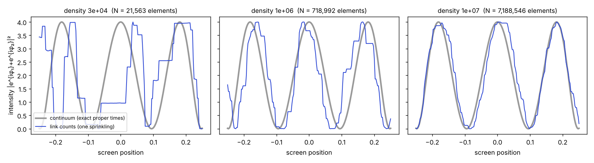
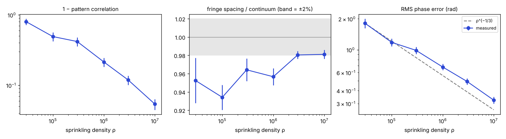

# Results 03 — Amplitudes from ordering

*Run 9 October 2026, against [SIM-SPEC-02-amplitudes.md](SIM-SPEC-02-amplitudes.md). Assumptions A1–A5 accepted by Neil before the run. Code in [sim/amplitudes/](sim/amplitudes/), committed before each test ran; raw output in `sim/amplitudes/results/`. Stack: Python 3.13, NumPy 2.5.3, SciPy 1.18.1, Numba 0.68.0.*

> **Review outcome, 9 October 2026: the derivation fails the spec's first kill condition.** An independent review ([REVIEW-03-amplitudes.md](REVIEW-03-amplitudes.md)) found that A3's justification borrows a quantum system. The cited theorem (Boes & Navascués) forces strong positivity only on a world that already contains quantum systems; Dowker & Wilkes's uniqueness result needs an extra condition (Galois self-duality) that the spec missed. Test 2 shows the same thing in numbers: the qubit caught all 22 rules that fail only under composition; a copy of the system caught one. Both papers were checked against their text after the review and the reviewer is right. **The derivation as specified (spec §4) fails.**
>
> What stands: A2 and A5 hide no phase rule; the Herglotz step is correct; the argument is not found in the literature; Tests 1–3 are honest and stay inside what they show. The proposed Stress Map moves are withdrawn: "Why amplitudes cancel" and "Born rule" stay at *strains*.
>
> Corrections the review asked for are made below: Test 3's result is moved out of "established by test" (it could not fail); two limits are added (equal weights; real kernels only in Test 2). A candidate repair of A3 is recorded as a lead at the end. It has not been checked and has not been adopted.

**Headline (as written before the review):** All three tests pass against the conditions set in advance. **Link counts on a random discrete spacetime work as clocks:** the double-slit pattern built from them converges to the exact continuum pattern as density grows (pattern correlation 0.20 → 0.95). **Positivity under composition does the work A3 claims:** every comparison rule that is not positive semidefinite gave a negative probability once composed with a qubit, and no positive semidefinite rule ever did. **Decoherence reads exactly as a spread of clock rates.** One number was weak: the fringe spacing passed its 2% bar by a hair, with a residual bias of about 2%. A follow-up one density higher shows the bias halving to 1% (follow-up below), so it is a finite-density effect, not an offset.

What this does and does not establish is in the last section. In short: the tests confirm the derivation's ingredients and its discrete carrier. They cannot confirm the derivation is free of circularity, and they do not show it is new.

---

## Summary table

| Test | Question | Result |
|---|---|---|
| 1 | Do link counts carry the phase well enough to give the right double-slit pattern? | **PASS** — correlation rises at every density step (0.20 → 0.95); spacing 0.981 at ρ = 10⁷ (bar: within 2%); RMS phase error falls as ρ^(−0.29 ± 0.01) (bar: −1/3 ± 0.08) |
| 2 | Do rules that break positivity give negative probabilities, at least once composed? | **PASS** — 52 of 52 non-positive rules caught (22 only under composition); 0 of 31 positive rules ever negative |
| 3 | Is decoherence a spread of clock rates? | **PASS** — exact to 10⁻¹⁶ on both August dephasing data sets; spread grows at every added environment spin |

---

## Test 1 — Are link counts good enough clocks?

**Set-up.** Poisson sprinkling of 1+1 Minkowski space (c = 1) at density ρ, over the region between a source event at the origin and a screen at t = 1 (screen half-width 0.25). Two slits at t = 0.5, centred at x = ±0.1, each a slab 0.02 wide and 0.02 thick. For each of 201 screen points and each slit, the clock reading of the history is the **longest chain** from the source to the screen point that contains an element inside that slit. Pattern: |e^{iMτ̂₁} + e^{iMτ̂₂}|², with M = 90 (three fringes across the screen).

**The clock is calibrated on straight histories and used on bent ones.** On 10 independent sprinklings per density, the mean longest chain from the source to points on the axis is fitted as n = aτ + bτ^{1/3} + c (the continuum form). The test histories bend at a slit, so the calibration cannot absorb the test's geometry. The **continuum reference** is the exact proper time of the same histories: the maximum over each slit of τ(source, p) + τ(p, screen point).

**Code check.** The fast chain code (light-cone coordinates, Fenwick tree) was compared with an O(N²) brute-force recomputation written directly from the causal relation, on six sprinklings with fat slits: all straight and through-slit chain lengths identical ([check_cs.py](sim/amplitudes/check_cs.py)).

**Results** (20 test sprinklings per density; mean ± standard error):

| Density ρ | Elements | Pattern correlation | Spacing / continuum | RMS phase error (rad) |
|---|---|---|---|---|
| 3 × 10⁴ | 2.2 × 10⁴ | 0.20 ± 0.08 | 0.953 ± 0.025 | 1.81 |
| 10⁵ | 7.2 × 10⁴ | 0.51 ± 0.07 | 0.934 ± 0.014 | 1.18 |
| 3 × 10⁵ | 2.2 × 10⁵ | 0.58 ± 0.06 | 0.964 ± 0.012 | 0.99 |
| 10⁶ | 7.2 × 10⁵ | 0.79 ± 0.03 | 0.957 ± 0.009 | 0.68 |
| 3 × 10⁶ | 2.2 × 10⁶ | 0.88 ± 0.02 | 0.980 ± 0.004 | 0.49 |
| 10⁷ | 7.2 × 10⁶ | 0.946 ± 0.009 | 0.981 ± 0.005 | 0.32 |




**Against the pass conditions:**
- Correlation rises at every step; 1 − correlation falls as ρ^(−0.46). **Met.**
- Spacing within 2% at the highest density: 0.9811. **Met, by 0.1%.**
- RMS phase error exponent −0.287 ± 0.012, inside −1/3 ± 0.08. **Met.** It is shallower than −1/3 by about four standard errors; over the last two densities it is −0.35.

**The calibration hardly matters.** The raw clock τ̂ = n/√(2ρ), with no fitting at all, gives correlation 0.945 and spacing 0.980 at ρ = 10⁷, the same as the calibrated clock. The link count is itself the clock.

**One change, made before any metric was computed:** the first launch stopped at ρ = 10⁴ because a slit held no elements in one sprinkling (about 4 expected); that density was dropped. Recorded in the script.

### Follow-up — the spacing bias *(written after the verdict; cannot change it)*

The spacing at ρ = 10⁷ is 0.981 ± 0.005: inside the bar, but about four standard errors below 1. A fixed offset would be a problem; a finite-density bias that keeps shrinking would not. [test1b_followup.py](sim/amplitudes/test1b_followup.py) repeated Test 1's method on fresh sprinklings at 3 × 10⁶ and one density higher, 3 × 10⁷ (2.2 × 10⁷ elements per sprinkling):

| Density | Spacing / continuum | Correlation | RMS phase error |
|---|---|---|---|
| 3 × 10⁶ (fresh seeds) | 0.971 ± 0.005 | 0.883 | 0.49 |
| 3 × 10⁷ | **0.991 ± 0.003** | **0.975** | **0.23** |

**The bias keeps shrinking:** about 4% at 10⁶, 2–3% at 3 × 10⁶, 2% at 10⁷, 1% at 3 × 10⁷. A power-law fit gives ρ^(−0.42 ± 0.08), consistent with the ρ^(−1/3) expected for finite-size effects in chain length. The RMS phase error from 10⁷ to 3 × 10⁷ falls with exponent −0.32. The mean phase error across the screen is antisymmetric (−0.08 rad at the left edge, +0.10 at the right, 0.01 at the centre), which is what a slight under-stretching of the phase looks like. Its likely source is the finite-size correction to chain length, which differs between straight histories (used to calibrate) and bent ones (used in the test); that was not checked. **Reading: a finite-density bias, not an offset.**

---

## Test 2 — Is positivity doing the work?

**Set-up.** A comparison rule f depends only on the difference of clock readings (A2). An event is a set of histories, so a vector of counts c over readings, and P = Σ c_a c_b f(a − b). 83 rules: short-range f(±1) = a for a from −1 to 1; random three-term cosine series; random short-range rules; plus the two rules the first run missed (below). Whether each rule is positive semidefinite was decided independently, by Herglotz (its Fourier series must be ≥ 0). Three settings were searched for an event with P < 0: the system **alone**; composed with an independent **copy** of itself; composed with one independent **qubit** with amplitudes (1, −1).

**Result.**

| | Count |
|---|---|
| Rules that are not positive semidefinite | 52 |
| … caught alone | 30 |
| … caught only under composition | 22 (all by the qubit; 1 also by the copy) |
| Positive semidefinite rules ever giving P < 0 | **0 of 31** |

The clearest case is f(±1) = a. For a < −1/2 the rule fails alone. For a > +1/2 it **never** fails alone (every term is positive when counts are non-negative), and fails only once composed with a qubit. This is exactly the case A3 exists for: a rule that looks harmless on its own and breaks when the system meets the rest of the world.

**Composition with a copy of itself almost never exposes a bad rule (1 of 22); composition with a quantum system always does.** This matches Boes & Navascués: it is composition with quantum systems, not with classical ones, that forces strong positivity.

**First run missed two rules; recorded.** The first run allowed at most 3 histories per reading and stopped growing the search window at the first negative eigenvalue. It missed two non-positive rules whose windowed negative eigenvalues were tiny (−0.007, −0.0005). The pass condition is about whether a negative-probability event *exists*, so the search was strengthened (up to 30 histories per reading; larger windows). Kernels were also given their own random stream so the search could not change them, and the two missed rules were carried over exactly. Both are now caught under composition. First-run table: `results/test2_first_run_console.txt`.

*This test checks a known theorem numerically (Herglotz; Boes–Navascués; Dowker–Wilkes). It is not new physics.*

---

## Test 3 — Is decoherence a spread of clock rates?

One family of rate distributions throughout: the law of ω = Σ ±g_k (independent equal-weight signs, couplings g_k), of width σ = √(Σ g_k²).

| August data | Result |
|---|---|
| RESULTS-01 Test 1 dephasing sweep (visibility 1 − p) | One coupling g = arccos(1 − p) reproduces it to 1.1 × 10⁻¹⁶; σ rises with p from 0 to π/2 |
| RESULTS-01 Test 2 central spin (N = 1 … 1000, same random draws regenerated) | Atom-by-atom enumeration of the rate distribution matches the coherence to 1.7 × 10⁻¹⁶ (N ≤ 16); slope of log median coherence vs N reproduced: −0.8097; σ rises at every added spin, as N^0.50 |

**Reading:** each environment configuration gives the two branches a different relative clock rate; averaging over configurations is integrating over a positive distribution of rates; that is exactly §4's formula. A sharp rate means full interference; a spread rate means loss of fringes; coupling more environment widens the spread. **Thickness (coherence, set by local coupling) is how sharply a history's clock rate is defined.**

*This is a known identity (pure dephasing as an average over random phases), seen through RFF's terms. It could not fail.*

---

## What this establishes, and what it does not

**Established, by test:**
- In 1+1 dimensions, on random discrete spacetime, **counting links along a chain is a working clock** for the clock-hand picture: the double-slit pattern converges to the exact one, with no fitting needed at high density. §1(a) of the spec now has a discrete carrier. *(Unaffected by the review.)*
- The composition argument behind A3 behaves as the theorems say, including the case where a rule only fails on meeting a quantum system. *(This is also the review's evidence against A3: what forces positivity is the qubit.)*

**A known identity, not a test:** decoherence reads exactly as a spread of clock rates (Test 3). The test could not have refused this reading.

**Established, by argument (spec §4), not by test:** given A1–A5 *with strong positivity taken as given*, Herglotz's theorem forces "each link turns the hand by a fixed angle; hands add; square." The review confirms the mathematics. What fails is the justification of A3 (review outcome, top).

**Not established:**
- ~~That A1–A5 contain no phase rule in disguise.~~ **Settled by review: A3's justification borrows a quantum system. Kill condition 1 met.** A2 and A5 are clean.
- **That this is new.** The reviewer did not find this argument in Sorkin, Dowker–Johnston–Sorkin, Gudder, Anastopoulos or Hartle. Gudder and Hartle have not been read in full.
- **Unequal weights.** A2 gives every history the same weight, so the argument does not deliver the general path-integral weight, only the phase between near-equal histories (the two-path case tested).
- **The complex half.** Test 2 used real symmetric kernels only. Single-angle (complex) kernels are covered by the theorem, not by the numbers.
- **Why pairs (A1).** Still the single named input of the quantum column. Lead: higher-order sum rules permit signalling under stated assumptions (Joshi, Srikanth & Sinha), not yet read.
- **Beyond the tested case:** one free particle, two stationary histories, 1+1 dimensions. Not the full sum over all histories, not 3+1, not many particles, not spin. The 4 October calculation had the same scope.

**Stress Map:** ~~"Why amplitudes cancel" and "Born rule" from *strains* to *fits with work*~~ withdrawn after review; both stay at *strains*. Still proposed as drafts: "Granular spacetime" (the link count is the clock, from Test 1) and "Decoherence" (spread of clock rates, as a known identity).

### Lead after the review — a possible repair of A3 *(adopted by Neil 9 Oct; written up as [SIM-SPEC-02 §9](SIM-SPEC-02-amplitudes.md); awaiting review, [brief 04](REVIEW-BRIEF-04-amplitudes-repair.md))*

Dowker & Wilkes (arXiv:2011.06120) also prove **Theorem 4: any tensor-closed set of systems lies entirely within the strongly positive systems, or entirely within the positive-entry systems** (every D(A, B) real and non-negative). No other hypothesis. *(Wording checked against the paper's text on 9 October; the reviewer should confirm.)*

A positive-entry system can never show a dark fringe: destructive interference needs Re D(A, B) < 0. So:

- **A3′** — every system in the world can be combined with every other, and every combination keeps probabilities non-negative (the world's systems are tensor-closed);
- **E1** — destructive interference is observed somewhere (dark fringes exist, an observation with no theory attached);
- then, by Theorem 4, every system is strongly positive, and the rest of §4 goes through.

This would borrow no qubit, no Hilbert space and no Gram matrix: only the observed fact that something, somewhere, cancels. It would explain the **form** of interference everywhere (clock hands, the square), **given** that interference exists. It would **not** explain why interference exists at all. Test 2's pattern fits it: f(±1) = 0.8 is positive-entry and survives copies of itself forever, but cannot share a world with a system that cancels.

Neil signed off on 9 October. It still needs a fresh independent check, since the author proposed both the original and this repair.

---

## Reproduce

```bash
cd sim/amplitudes
python check_cs.py           # brute-force check of the chain code (~1 min)
python test1_link_clock.py   # ~8 min on 2 cores
python test1b_followup.py    # follow-up, ~30 min
python test2_positivity.py   # ~10 min
python test3_spread_rate.py  # seconds
python make_figures.py
```

## Sources

- Logan & Shepp, Adv. Math. 26, 206 (1977); Vershik & Kerov, Soviet Math. Dokl. 18, 527 (1977) — longest increasing subsequence ≈ 2√N, the 2D longest-chain constant
- Baik, Deift & Johansson, J. Amer. Math. Soc. 12, 1119 (1999) — its fluctuations scale as N^{1/6}
- Brightwell & Gregory, PRL 66, 260 (1991) — proper time from longest chains in causal sets
- Boes & Navascués, PRA 95, 022114 (2017), arXiv:1609.09723; Dowker & Wilkes (2022), arXiv:2011.06120 — strong positivity from composition
- Dowker, Johnston & Sorkin, J. Phys. A 43, 275302 (2010), arXiv:1002.0589 — Hilbert space from a strongly positive decoherence functional
- Joshi, Srikanth & Sinha (2016), arXiv:1308.6065 — higher-order sum rules and signalling *(not yet read)*
- Further prior art: [SIM-SPEC-02](SIM-SPEC-02-amplitudes.md) §3
