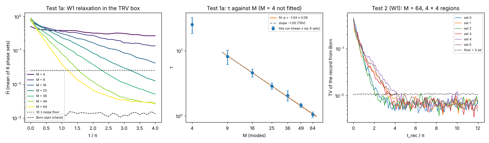
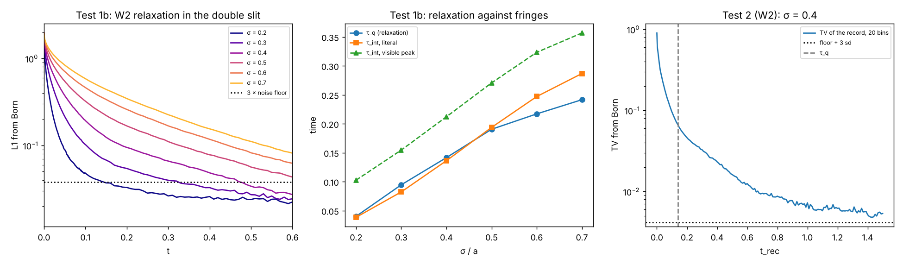
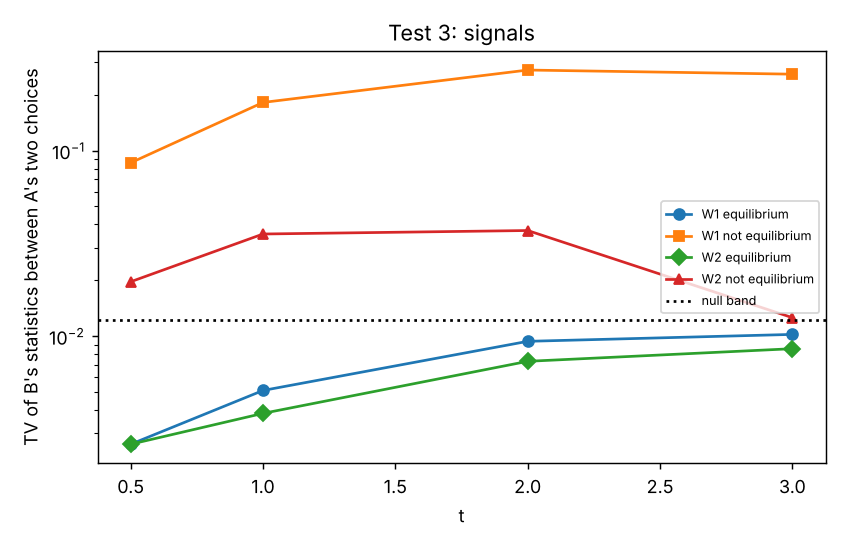

# Results 04 — Selection: does the loom relax to Born?

*Run 10 October 2026, against [SIM-SPEC-03-selection.md](SIM-SPEC-03-selection.md). Neil approved the pass conditions on 10 October, on the condition that each matches known physics; §5 of the spec gives each source. Code in [sim/selection/](sim/selection/). The physics code was committed before each main run; two later changes touch only the order of runs (run_box.sh) and a file write (signal2p.py). Raw output in `sim/selection/results/`. Stack: Python 3.13, NumPy 2.5.3, SciPy 1.18.1, Numba 0.68.0, two cores.*

> **Outcome.** W1 (the steered seed, pilot-wave type) passes all of its tests. The W2 verdicts (the seed with kicks, Nelson type) are **pending**. One W2 set-up check (step size) missed its limit by 0.26 percentage points, and spec §6 says: fix the code before you read any pass condition. The check failed on one number, τ_q, which is the published definition of the relaxation time. In this run τ_q is fragile: its fit reduces to a straight line through ln L1, and the fit window changes it by 1.3 to 2.6 times. The L1 curves themselves converged. The Test 2 band also used τ_q as a relaxation time. That is an error in the test design, and Claude made it.
>
> **Decision for Neil.** How to fix the W2 measure of relaxation time before a W2 rerun. Section "Decisions" gives two options and a recommendation. The W2 numbers below are for the record. They are not verdicts.

---

## Summary table

| Test | Question | Rule | Result |
|---|---|---|---|
| 1a | Does W1 relax at the published rate? | W1 | **PASS** — τ ∝ M^p with p = −1.04 ± 0.09 (TRV: −1.05 ± 0.03; band −1.05 ± 0.20) |
| 1b | Does W2 reach Born before the fringes form? | W2 | **PENDING** — a set-up check failed (step size 5.3%, limit 5%; spec §6) |
| 2 | Is a record that forms early not Born, and a late one Born? | W1 | **PASS** — the record's error falls on 2.6 τ (band 0.5 τ to 4 τ) and reaches the noise floor |
| 2 | (same) | W2 | **PENDING** — same check. The record's error falls from 0.90 to the floor; against the τ_q band it would not be met (0.08 τ_q) |
| 3 | Does equilibrium forbid signals? | W1 | **PASS** — no signal at equilibrium; out of equilibrium, up to 27% of B's probability moves |
| 3 | (same, equilibrium part) | W2 | **PASS**; out of equilibrium (report only): a smaller signal that fades as the seeds relax |

---

## Changes to the code before and during the runs

All changes are in the script docstrings and in spec §5.5. Each W1 check run that failed stays in `results/` with `FAILED` in its name. The failed W2 step check is `nelson_step_s20.npz`.

| When | Change | Reason |
|---|---|---|
| Before any run | Test 1b: second definition of τ_int changed | The first version (centre at half the highest peak) was already true at t = 0 for σ = 0.7 |
| After the first W1 check, before any main run | W1 step limit 0.02 → 0.01 | Equivariance check failed: a Born start drifted from H̄ = 0.0012 to a maximum of 0.0035 (0.0030 at 4π) |
| After the second W1 check, before any main run | W1 step limit 0.01 → 0.005; step check 0.0025; N = 10⁵ → 5 × 10⁴ for the main runs | Equivariance check failed by a small margin (mean 2.4, maximum 5.1 floor deviations; limit 5). The smaller N keeps the compute time near 5 hours |
| After the Test 3 run | A type cast in the JSON write | The run printed all verdicts, then stopped at the file write. The rerun gave identical numbers |

---

## Test 1a — W1 relaxes as published (Towler, Russell & Valentini 2012)

**Set-up.** As in the spec: the TRV box (side π, ħ = m = 1), M equal-weight modes with random phases, 6 phase sets for each M. Start spread: the ground state. 5 × 10⁴ seeds move with the guidance equation; RK4 with a step limit of 0.005. Coarse cells 16 × 16 (TRV's coarsest grain). Output every π/8 to 4π. Code: [box2d.py](sim/selection/box2d.py), [analyse_box.py](sim/selection/analyse_box.py).

**Checks.**

| Check | Result | Limit | Verdict |
|---|---|---|---|
| Equivariance: max H̄ of a Born start (M = 64, N = 10⁵) | 0.00155 | below floor + 5 sd at each time (about 0.0018) | OK |
| Step size: τ at step limits 0.005 and 0.0025 (M = 64, set 0) | 1.037 and 1.040 (0.3%) | 5% | OK |

Seeds that a step put outside the box, and that the code reflected back: at most 186 of 5 × 10⁴ over 12π (M = 64), and none or almost none for M ≤ 25.

**Results** (mean ± standard deviation over 6 phase sets):

| M | 4 | 9 | 16 | 25 | 36 | 49 | 64 |
|---|---|---|---|---|---|---|---|
| τ | 25 ± 7 *(not fitted)* | 8.1 ± 2.0 | 4.6 ± 0.6 | 2.9 ± 0.3 | 2.1 ± 0.4 | 1.46 ± 0.11 | 1.06 ± 0.10 |

Fit over M = 9 to 64: **τ = 82.6 · M^p, with p = −1.042 ± 0.086.** TRV found p = −1.05 ± 0.03 at this grain. The pass band was −1.05 ± 0.20. **Met.**

**M = 4 keeps a residue.** H̄ falls only from about 0.5 to about 0.2–0.4 by 4π, in all 6 phase sets. This agrees with TRV, who left M = 4 out, and with Abraham, Colin & Valentini (2014), who found residues that last for 50 periods with 4 modes.

**What Test 1a shows.** The W1 code reproduces the published rate. The more modes the pattern has, the faster the seeds relax, and the rate is close to 1/M. For M = 64, τ is about 1, which is one twelfth of one period of ψ (4π).

## Test 1b — W2 relaxes as published (Hardel, Hervieux & Manfredi 2023)

**Set-up.** As in the spec: the 1D double slit with ħ = m = a = 1, two Gaussians at ±1, free motion, D = 1/2. All 4 × 10⁵ seeds start at x = ±1. Euler–Maruyama with dt = 10⁻⁴, to t = 1.5. L1 uses 100 bins of equal Born weight. Code: [nelson1d.py](sim/selection/nelson1d.py).

**Checks.**

| Check | Result | Limit | Verdict |
|---|---|---|---|
| Figure: σ = 0.09, t = 0.12, maximum at x = 0 | yes | — | OK |
| Equivariance: max L1 of a Born start (σ = 0.4) | 0.0150 | 0.0171 | OK |
| Step size, σ = 0.7: τ_q at dt 10⁻⁴ and 5 × 10⁻⁵ | 0.2415, 0.2431 (0.7%) | 5% | OK |
| Step size, σ = 0.2: τ_q at dt 10⁻⁴ and 5 × 10⁻⁵ | 0.0401, 0.0423 (5.3%) | 5% | **FAILED** |

**By spec §6, the Test 1b verdict is pending**, because one check failed. The numbers below are for the record only.

**What the failed check means** *(found after the run)*. The L1 curves at the two step sizes agree within 0.004 at every output time inside the fit window (σ = 0.2 and σ = 0.7). Their half times are the same (0.003 and 0.034). So the dynamics converged. Only the fitted number τ_q moved. Section "τ_q is fragile" below gives the reason.

**Numbers from the run** (not verdicts):

| σ | τ_q | τ_int, literal | τ_int, visible peak | Literal: τ_q < τ_int? | Visible: τ_q < τ_int? | τ_q with a 10× window (report) |
|---|---|---|---|---|---|---|
| 0.2 | 0.0401 | 0.0384 | 0.1026 | no | yes | 0.0160 |
| 0.3 | 0.0945 | 0.0822 | 0.1545 | no | yes | 0.0367 |
| 0.4 | 0.1415 | 0.1362 | 0.2120 | no | yes | 0.0563 |
| 0.5 | 0.1904 | 0.1936 | 0.2705 | yes | yes | 0.1037 |
| 0.6 | 0.2170 | 0.2470 | 0.3233 | yes | yes | 0.1555 |
| 0.7 | 0.2415 | 0.2867 | 0.3567 | yes | yes | 0.1855 |

Read as a verdict, this would be **partial**: τ_q < τ_int for every σ with the visible-peak definition, but only for σ ≥ 0.5 with the literal definition. For σ ≤ 0.4, τ_q is larger than the literal τ_int by 4% to 15%.

### τ_q is fragile

τ_q is the published definition: fit L1(t) = α₁ exp(−α₂ e^(α₃t)), then τ_q = 1/(α₂α₃), the point where the tangent at t = 0 meets the time axis. Two facts from this run show that τ_q is not a stable relaxation time:

1. **The fit window changes it by 1.3 to 2.6 times.** With the window L1 > 10 × floor instead of 3 × floor, τ_q falls from 0.0401 to 0.0160 at σ = 0.2 (2.5 times), and from 0.2415 to 0.1855 at σ = 0.7 (1.3 times).
2. **The fit is degenerate.** For every σ, the fitted α₂ is about 3 × 10⁴ and α₃ is 10⁻⁴ to 10⁻³. The fitted curve is then a straight line through ln L1, and τ_q is only its e-fold time. The published form can bend only one way (slow first, fast later). Our curves bend the other way: L1 falls very fast at first, and then slowly. At σ = 0.4, L1 halves by t = 0.009, but τ_q is 0.14.

The physics does not depend on this. When the first central maximum forms (the literal τ_int), L1 is already down to 6% to 12% of its start, for every σ (6.1% at σ = 0.2, 7.1% at σ = 0.4, 12.2% at σ = 0.7). L1 halves between t = 0.0023 (σ = 0.2) and t = 0.033 (σ = 0.7), which is 9 to 17 times earlier than the first central maximum. So most of the relaxation comes first in every case. But complete relaxation (L1 down to 3 times its floor) takes 3 to 4 times longer than the literal τ_int, for every σ. So "Born before the fringes" is true for the bulk of the relaxation, and not true for its end.

**A slow tail at every σ.** For t ≥ 1, L1 stays at 1.4 to 1.9 times its floor (0.0126), above the floor plus 3 standard deviations, for every σ. It still falls slowly. Only TV over 20 bins at σ = 0.4 (Test 2) reaches its band by t = 1.5. A Born start stays below 1.2 times the floor (the equivariance check), so the tail is most likely relaxation that is not complete, not an error of the integrator. This is reported only.

## Test 2 — The race between relaxation and the record

The record is ideal: it reads the outcome region at t_rec. So the outcome frequencies are the coarse-grained spread at t_rec. TV is the largest error in the probability of any outcome.

### W1 (the box, M = 64, 6 phase sets, to 12π)

| Quantity | Result | Pass condition | Verdict |
|---|---|---|---|
| e-fold time T_TV of the record's error (mean of 6 sets) | 2.70 = 2.56 τ | between 0.5 τ and 4 τ | **met** |
| Median TV at t_rec = 12π | 0.0069 | below 0.0107 (floor + 3 sd) | **met** |

T_TV for the six phase sets: 1.83, 3.20, 1.76, 2.55, 3.68 and 3.20. The expected value for a small difference is about 2 τ, because TV scales as √H̄.

**The race in numbers** (mean of the 6 sets; τ = 1.06; noise floor 0.007):

| t_rec / τ | 0 | 0.5 | 1 | 2 | 4 | 8 | 12 | 20 |
|---|---|---|---|---|---|---|---|---|
| TV of the record from Born | 0.43 | 0.27 | 0.20 | 0.11 | 0.048 | 0.017 | 0.008 | 0.007 |

**Test 2 passes for W1.** A record that forms before relaxation is far from Born. In this box, the mean error of the 6 records reaches the noise band (about 0.011) at about 10 τ. Below that level, the noise of 5 × 10⁴ seeds hides any further difference. This is the quantitative form of §9 point 3 for W1.

### W2 (the double slit, σ = 0.4)

| Quantity | Result | Pass condition | Verdict |
|---|---|---|---|
| TV of the record at t_rec = 0 | 0.900 | — | — |
| TV at t_rec = 1.5 | 0.0054 | below 0.0083 (floor + 3 sd) | would be met |
| Half time t½ of TV | 0.0114 | between 0.25 τ_q and 4 τ_q (0.035 to 0.57) | would not be met (0.08 τ_q) |

**By spec §6, this verdict is also pending**, because it uses the same run and the same τ_q. Read against the band, it would not be met. So the Test 2 kill condition has not fired.

**What the numbers mean** *(found after the run)*. The band compared the half time of TV with τ_q, as if τ_q were a relaxation time. It is not (see "τ_q is fragile"). The error is in the test design, which Claude wrote. The data show the race itself:

| t_rec | 0.001 | 0.005 | 0.01 | 0.02 | 0.05 | 0.1 | 0.2 | 0.4 | 0.8 | 1.5 |
|---|---|---|---|---|---|---|---|---|---|---|
| TV of the record from Born | 0.777 | 0.567 | 0.475 | 0.336 | 0.188 | 0.096 | 0.046 | 0.023 | 0.009 | 0.005 |

A record that forms early is far from Born. A record that forms late is at Born, within the noise. Against the half time of L1 (0.0092), the half time of TV (0.0114) has a ratio of 1.25. Claude computed that ratio after the verdict, so it is not a test.

## Test 3 — Equilibrium forbids signals

**Set-up.** As in the spec: two entangled particles in traps, a pulse exp(ix₁²) at A or nothing, 10⁵ seeds, the same start points for both choices. Code: [signal2p.py](sim/selection/signal2p.py).

**Checks.** The closed forms agree with a split-step evolution within 2.5 × 10⁻⁸. The gradient formula agrees with a finite difference within 2.4 × 10⁻⁹. B's Born marginal is the same for both choices within 6 × 10⁻¹⁶. All OK.

**Results.** TV between B's histograms for A's two choices. Null band: 0.0122 (mean 0.0082, sd 0.0013).

| Rule, seeds | t = 0.5 | t = 1 | t = 2 | t = 3 | Verdict |
|---|---|---|---|---|---|
| W1, equilibrium | 0.0026 | 0.0051 | 0.0094 | 0.0102 | inside the band: **met** |
| W1, not equilibrium | 0.0860 | 0.1821 | 0.2723 | 0.2586 | above the band: **met** |
| W2, equilibrium | 0.0026 | 0.0038 | 0.0073 | 0.0086 | inside the band: **met** |
| W2, not equilibrium | 0.0196 | 0.0355 | 0.0371 | 0.0126 | report only |

**Test 3 passes for W1, and its equilibrium part passes for W2.** With Born seeds, nothing A does shows at B. With seeds out of equilibrium, W1 gives B a large change: up to 27% of the probability moves. W2 also gives a signal out of equilibrium, but it is about 7 times smaller, and by t = 3 it is almost back at the band (0.0126 against 0.0122). Relaxation of the W2 seeds would give this, but Test 3 does not measure their relaxation.

The rerun after the JSON fix gave the same numbers as the first run, to the last digit.

---

## What this shows, and what it does not

**What it shows.** With W1, the loom of spec §1 works, in this box:

1. *One outcome for each seed, with no randomness at the record.* This is true of W1 by construction. It is not a result.
2. *Any spread moves to the exact Born spread.* Test 1a used one start spread, far from Born. It moves toward Born at the published rate. By 4π it reaches the noise floor for M ≥ 49 and is within 3 times the floor for M = 36. For M = 9 to 25 it is still on its way (H̄ 2 to 120 times the floor). With M = 4, a residue stays.
3. *Fast, before the record.* τ is about 1 for M = 64, which is one twelfth of a period of ψ. The mean error of a record reaches the noise band at about 10 τ (Test 2).
4. *No signals once relaxation is complete.* Test 3. Before relaxation, W1 permits large signals. So RFF needs relaxation to be complete wherever an experiment can look.
5. *It samples the pattern and does not change it.* The equivariance check: a Born spread stays Born.

**What it does not show.**

- **Nothing here is new physics.** Every result is published: Bohm (1952), Valentini (1991, 2002), Towler, Russell & Valentini (2012). RFF adopts this dynamics and reads it as the loom.
- **Which rule nature uses.** The rules differ only out of equilibrium (spec §8).
- **Relaxation is not always complete.** With few modes, a residue can stay (M = 4 here; Abraham, Colin & Valentini 2014). RFF needs this for its possible CMB test, but it also means that simple, isolated systems possibly keep statistics that are not Born.
- **A record that forms at a finite rate.** This run used an ideal, instant record (spec §8).
- **W2.** Its verdicts are pending (decision 1 below). Wallstrom's extra condition for W2 is not treated here.
- **One system for each rule, one start spread, one grain.**

---

## Decisions for Neil

**1. How to fix the W2 measure of relaxation time.** The W2 step check failed, so by spec §6 both W2 verdicts are pending, and no kill condition has fired. The check failed on τ_q. In this run, τ_q is not a property of the dynamics: its fit is degenerate, and the window changes it by 1.3 to 2.6 times. The L1 curves at the two step sizes agree within 0.004.

- **(a) Keep τ_q.** Rerun the step check with smaller steps, then read the verdicts. Claude does not recommend this. A 5% agreement of a degenerate fit is a matter of chance, and the Test 2 band would still treat τ_q as a relaxation time.
- **(b) Replace τ_q with a time that needs no fitted model,** and rerun W2 on fresh seeds. Use the half time of L1 in the step check and as the reference time of the Test 2 band. For Test 1b, report the facts from the curves and set no single pass condition: the bulk of the relaxation comes 9 to 17 times before the first fringe, and complete relaxation (L1 at 3 times the floor) comes 3 to 4 times after it. Claude saw the data before this choice, so the write-up will mark the rerun as a second test, not a first one.

**Recommendation: (b).** If it holds, §9 point 3 stays, with one note: for W2, the last part of relaxation can come after the first fringes. Fringes are not records, so this does not conflict with point 3.

**2. The few-mode residue.** With M = 4, the seeds do not relax within 4π. Should RFF state that simple isolated systems possibly keep statistics that are not Born? This is the same physics as the possible CMB test, so Claude recommends yes.

---

## Map changes (proposed; statuses do not change)

| Item | Now | Proposed text change |
|---|---|---|
| Measurement: why one outcome | Fits with work | Selection named and shown for W1: a seed, steered by the pattern, relaxes to Born before the record (RESULTS-04). W2 waits for decision 1 |
| Born rule | Fits with work | The form comes from SIM-SPEC-02; the sample comes from relaxation (shown for W1, RESULTS-04) |
| Quantum seeds of galaxies | Fits with work | Few-mode systems can keep a residue that is not Born (M = 4 here); this is the mechanism of the possible CMB test |

## Sources

Listed in [SIM-SPEC-03](SIM-SPEC-03-selection.md) §3 and in [SOURCES.md](SOURCES.md) (October 2026, selection).
